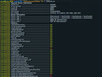

<p align="center"> 
  
</p>


For now, Illusion is a convenience layer on top of Vulkan, similar in spirit to [V-EZ](https://github.com/GPUOpen-LibrariesAndSDKs/V-EZ). However, I plan to add more features as I progress in learning.
Since everybody loves badges, here are some describing Illusion:

[](https://github.com/schneegans/illusion/actions)
[](https://coveralls.io/github/Schneegans/illusion?branch=feature/actions)
[](LICENSE)

[](cloc.sh)
[](cloc.sh)
[](cloc.sh)
[](cloc.sh)
[](https://gitter.im/illusion-engine/community)

Illusion uses C++17 and can be build on Linux (gcc or clang), Windows (msvc) and OS X (xcode). Nearly all dependencies are included as [git submodules](externals), please refer to the section [Building Illusion](#building-illusion) in order to get started.

I try to add as many comments to the source code as possible. The number of source code lines and comment lines above is computed with the script [cloc.sh](cloc.sh). This script only counts *real comments*. Any dumb comments (such as copy-right headers or stuff like `/////////`) are not included in this number.

## Features

- [ ] Vulkan convenience layer
  - [x] Automatic Vulkan object lifetime management using reference counting
  - [x] Automatic resource re-creation on swapchain changes
  - [x] Very readable validation error messages since Illusion forces you to assign descriptive names to each and every Vulkan object (using `PFN_vkSetDebugUtilsObjectNameEXT`)
  - [x] Explicit graphics state per command buffer
  - [x] Explicit binding state per command buffer
  - [x] Explicit specialization constants state per command buffer
  - [x] A ring-buffer for per-frame resources
  - [x] Per-frame resource count is independent from swapchain image count
  - [ ] Automatic image layout transitions
  - [ ] ...
- [ ] Frame graph
  - [x] Automatically create render passes and subpasses with dependencies
  - [x] Automatically create framebuffer attachments
  - [x] Automatic image layout transitions of the framebuffer attachments
  - [ ] Texture input support
  - [ ] Async compute
  - [ ] Parallel render pass recording
  - [ ] Parallel subpass recording
  - [ ] In-depth testing :grimacing:
  - [ ] ...
- [x] Window creation using [glfw](https://github.com/glfw/glfw)
- [x] Mouse and joystick input using [glfw](https://github.com/glfw/glfw)
- [x] Shader support
  - [x] Loading from Spir-V, GLSL and HLSL using [glslang](https://github.com/KhronosGroup/glslang) - if you feel adventurous you can even mix GLSL and HLSL modules in one shader program :grimacing:
  - [x] Shader includes using `#extension GL_GOOGLE_include_directive`
  - [x] Automatic reloading of shaders when source file changed on disc
  - [x] Automatic shader program reflection using [spirv-cross](https://github.com/KhronosGroup/SPIRV-Cross)
  - [x] Automatic creation of pipeline layouts
  - [x] Automatic allocation and updates of descriptor sets
- [ ] Texture support  
  - [x] LDR and HDR texture loading using [stb](https://github.com/nothings/stb) (hdr, jpg, png, tga, bmp, ...)
  - [x] DDS texture loading using [gli](https://github.com/g-truc/gli)
  - [x] Automatic mipmap generation
  - [x] Conversion of equirectangular panoramas to cubemaps using compute shaders
  - [x] Creation of prefiltered irradiance and reflectance maps for physically based shading using compute shaders
  - [x] Creation of the BRDFLuT for physically based shading using compute shaders
  - [ ] Saving textures to files
- [ ] glTF loading using [tinygltf](https://github.com/syoyo/tinygltf)
  - [x] Metallic-roughness materials
  - [x] Specular-glossiness materials
  - [x] Animations
  - [x] Skins
  - [ ] Morph targets
  - [ ] Sparse accessors
  - [ ] Multiple texture coordinates
  - [ ] Multiple scenes
- [x] [Signal-Slot implementation](examples/SignalSlot) using only C++ standard library
- [x] [Command line parsing](examples/CommandLine) using only C++ standard library

## Included Examples

When compiled with [the commands below](#building-illusion), the examples will be located in `illusion/build/install/bin`. You can run them either by double-clicking or from the command line. For Linux, there is a shell script to start each example which sets the environment variables required for Vulkan.

The list below is roughly sorted by complexity. So if you want to learn features of Illusion step-by-step you can have a look at the example's code in that order.

Link | Core Utility Examples | Screenshot
:----|:----------------------|:----------
[Signal Slot](examples/SignalSlot) | This very small example shows some basic usage of Illusion's Signals and Properties. You can read some information on the implementation [on my blog](http://schneegans.github.io/tutorials/2015/09/21/properties). | 
[Command Line](examples/CommandLine) | This small example shows how to use Illusion's very basic command line parser. Use `CommandLine --help` to see the options. | 
**Link** | **Low-level Vulkan Examples** | **Screenshot**
[GPU Info](examples/GPUInfo) | This minimal example creates a Vulkan instance and prints a very verbose list of your Vulkan implementation's hardware and software capabilities. | 
[Headless](examples/Headless) | This rather simple example renders an image and save it to a file. This is done in headless-mode - no window or swapchain is created. | 
[Triangle](examples/Triangle) | A simple triangle without vertex or index buffers that uses a pre-recorded command buffer and no per-frame resources. | 
[Specialization Constants](examples/SpecializationConstants) | Similar to the Triangle example, but here three triangles are drawn with one shader program. For each triangle some specialization constants are set to different values. | 
[Textured Quad](examples/TexturedQuad) | Similar to the triangle, in addition a texture is loaded and bound as fragment shader input. This example can either use GLSL or HLSL shaders. Use `TexturedQuad --help` to see the options. | 
[Shader Sandbox](examples/ShaderSandbox) | An example similar to [ShaderToy](https://www.shadertoy.com). You can specify a fragment shader on the command line and it will be automatically reloaded when it changes on disc. Use `ShaderSandbox --help` to see the options. | 
[Textured Cube](examples/TexturedCube) | A more complex example using vertex buffers and an index buffer. Camera information is uploaded as uniform buffer, the cube's transformation is set via push constants. The command buffer is re-recorded every frame. The uniform buffer and the command buffer are per-frame resources. | 
[glTF-Viewer](examples/GltfViewer) | A viewer for glTF files. There are several command line options; have a look at `GltfViewer --help`. Most [glTFSample Models](https://github.com/KhronosGroup/glTF-Sample-Models/tree/master/2.0) are supported, including those with skinned animations. | 
[Deferred Rendering](examples/DeferredRendering) | A small test application for the frame graph implementation. It's still work-in-progress and will evolve as the frame graph gets more mature. You can adjust the number of light sources; have a look at `DeferredRendering --help`. | 

## Building Illusion

Illusion uses CMake for project file generation. Below are some exemplary instructions for Linux and Windows (here Visual Studio 2017) which you should adapt to your system.

### Dependencies

Nearly all dependencies are included as [git submodules](externals). Additionally you will need a C++ compiler, python3 and CMake. The following submodules are included in this repository and automatically build together with Illusion:

Submodule | Description
----------|------------
[glfw](https://github.com/glfw/glfw) | Used for window creation.
[gli](https://github.com/g-truc/gli) | Used for loading of dds textures.
[glm](https://github.com/g-truc/glm) | Used as math library.
[stb](https://github.com/nothings/stb) | Used for loading of LDR and HDR textures.
[glslang](https://github.com/KhronosGroup/glslang) | Used to compile GLSL to Spir-V
[spirv-cross](https://github.com/KhronosGroup/spirv-cross) | Used for shader program reflection.
[tinygltf](https://github.com/syoyo/tinygltf) | Used for loading of gLTF models.
[vulkan-headers](https://github.com/KhronosGroup/Vulkan-Headers) | This is usually part of the Vulkan SDK. In Illusion the Vulkan SDK is basically included in the submodules. This simplifies continuous integration.
[vulkan-loader](https://github.com/KhronosGroup/Vulkan-Loader) | Same as above.
[vulkan-validation-layers](../../KhronosGroup/Vulkan-ValidationLayers) | Same as above.
[spirv-tools](https://github.com/KhronosGroup/SPIRV-Tools) | Dependency of vulkan-validation-layers.
[spirv-headers](https://github.com/KhronosGroup/SPIRV-Headers) | Dependency of vulkan-validation-layers.

### Linux

```bash
git clone https://github.com/schneegans/illusion.git
cd illusion
git submodule update --init
mkdir build
cd build
cmake -DCMAKE_BUILD_TYPE=Release -DCMAKE_INSTALL_PREFIX=install ..
make -j install
```

Then you can execute an example with:

```bash
install/bin/Triangle.sh
```

### Windows

```bash
git clone https://github.com/schneegans/illusion.git
cd illusion
git submodule update --init
mkdir build
cd build
cmake -G "Visual Studio 15 2017 Win64" -DCMAKE_INSTALL_PREFIX=install ..
cmake --build . --target install
```

Then you can execute an example with:

```bash
cd install\bin
Triangle.exe
```

## Documentation

For now, there is no documentation in addition to the example applications and the inline code comments. This will change once the API is more or less stable. Right now, entire classes may change completely in one commit.

### Credits

Here are some resources I am using while developing this software.

* [Vulkan Tutorial](https://vulkan-tutorial.com/): A great starting point for learning Vulkan.
* [Tutorials by Sascha Willems](https://github.com/SaschaWillems/Vulkan-glTF-PBR/): In particular the glTF example was very useful to understand some concepts.
* [V-EZ](https://github.com/GPUOpen-LibrariesAndSDKs/V-EZ): Especially the shader reflection of Illusion is based on code of V-EZ.
* [Granite](https://github.com/Themaister/Granite): I learned a lot from this great Vulkan engine. 
* [glTF sample models](https://github.com/KhronosGroup/glTF-Sample-Models/tree/master/2.0): These are very usefulf!
* [HDRI Haven](https://hdrihaven.com): Thank you Greg Zaal for your awesome work!
* [icons8.com](https://icons8.com): Some great icons!
* [shields.io](https://shields.io): Some great badges!

### MIT License

Copyright (c) 2018-2019 Simon Schneegans

Permission is hereby granted, free of charge, to any person obtaining a copy
of this software and associated documentation files (the "Software"), to deal
in the Software without restriction, including without limitation the rights
to use, copy, modify, merge, publish, distribute, sublicense, and/or sell
copies of the Software, and to permit persons to whom the Software is
furnished to do so, subject to the following conditions:

The above copyright notice and this permission notice shall be included in all
copies or substantial portions of the Software.

THE SOFTWARE IS PROVIDED "AS IS", WITHOUT WARRANTY OF ANY KIND, EXPRESS OR
IMPLIED, INCLUDING BUT NOT LIMITED TO THE WARRANTIES OF MERCHANTABILITY,
FITNESS FOR A PARTICULAR PURPOSE AND NONINFRINGEMENT. IN NO EVENT SHALL THE
AUTHORS OR COPYRIGHT HOLDERS BE LIABLE FOR ANY CLAIM, DAMAGES OR OTHER
LIABILITY, WHETHER IN AN ACTION OF CONTRACT, TORT OR OTHERWISE, ARISING FROM,
OUT OF OR IN CONNECTION WITH THE SOFTWARE OR THE USE OR OTHER DEALINGS IN THE
SOFTWARE.
